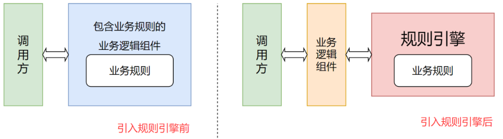

# 动态规则引擎
## 1. 规则引擎概述
规则引擎，全称为业务规则管理系统，英文名为 BRMS(Business Rule Management System)。规则引擎的主要思想是将应用程序中的业务决策部分抽离出来，并使用预定义的语义模块编写业务决策，由用户或开发者在需要时进行配置管理。规则引擎产品有 Drools、VisualRules、iLog 等。
系统引入规则引擎之后，业务规则不再以程序代码的方式驻留在系统中，取而代之的是处理规则的规则引擎，业务规则存储在规则库中，完全独立于程序。业务人员可以像管理数据一样对业务规则进行管理，比如查询、添加、更改、统计、提交业务规则等。业务规则被加载到规则引擎后，供系统的应用程序调用。



对于一些存在比较复杂的业务规则并且业务规则会频繁变动的系统比较适合使用规则引擎，如下：
*   风险控制系统 —— 风险贷款、风险评估
*   反欺诈项目 —— 银行贷款、征信验证
*   决策平台系统 —— 财务计算
*   促销平台系统 —— 满减、打折、加价购

## 2. 项目介绍
### 2.1 项目概述
目标：在程序运行的过程中，动态去修改规则。

实现：将规则文件保存到数据库中，实现规则的动态加载、刷新。

### 2.2 项目结构
```text
drools-demo
├─doc
│  ├─init-sql       初始化 sql
│  └─readme-img     readme 图片
│
└─src
   └─main
       ├─java
       │  └─com
       │      └─ovit
       │          └─drools
       │              │  Application.java                   启动类
       │              │
       │              ├─utils                             
       │              │      DroolsManager.java             规则引擎工具类
       │              │
       │              ├─controller
       │              │      DroolsRuleController.java      规则引擎暴露接口
       │              │
       │              ├─entity
       │              │      DroolsRule.java                规则实体
       │              │
       │              ├─mapper
       │              │      DroolsRuleMapper.java          规则持久层
       │              │
       │              └─service
       │                  │  DroolsRuleService.java         规则逻辑层
       │                  │
       │                  └─impl                            规则逻辑实现
       │
       └─resources
           │  application.yml                               项目配置文件
           │
           └─rules                                          默认规则存放目录
                   template.drl.bak                         示例规则文件
```

### 2.3 项目接口
**查询所有规则**
- 请求地址：/drools/rule/findAll
- 请求方法：GET
- 请求参数：空参
- 返回结果：List<DroolsRule>

**添加规则**
- 请求地址：/drools/rule/add
- 请求方法：POST
- 请求参数：DroolsRule
- 返回结果：Boolean

**修改规则**
- 请求地址：/drools/rule/update
- 请求方法：PUT
- 请求参数：DroolsRule
- 返回结果：Boolean

**删除规则**
- 请求地址：/drools/rule/deleteRule
- 请求方法：DELETE
- 请求参数：DroolsRule
- 返回结果：Boolean

**数据模型**

DroolsRule

|字段| 说明    |
|---|-------|
|ruleId | 规则id  |
|ruleName | 规则名称  |
|kieBaseName| 规则库名称 |
|kiePackageName | 规则包路径 |
|ruleContent | 规则内容  |
|createdTime | 创建时间  |
|updateTime | 修改时间  |


## 3. 项目解析
> 主要为 DroolsManager 解析，其余基本为 CRUD 操作不做赘述
### 3.1 动态构建 kmodule.xml


**创建 kmodule.xml**
```java
// 判断该 kbase 是否存在
boolean existsKieBase = existsKieBase(kieBaseName);
// 该对象对应 kmodule.xml 中的 kbase 标签
KieBaseModel kieBaseModel = null;
if (!existsKieBase) {
    // 创建一个 kbase
    kieBaseModel = kieModuleModel.newKieBaseModel(kieBaseName);
    // 不是默认的 kieBase
    kieBaseModel.setDefault(false);
    // 设置该 KieBase 需要加载的包路径
    kieBaseModel.addPackage(droolsRule.getKiePackageName());
    // 设置 kieSession
    kieBaseModel
            // 名称
            .newKieSessionModel(kieBaseName + "-session")
            // 不是默认 session
            .setDefault(false);
} else {
    // 获取到已经存在的 kbase 对象
    kieBaseModel = kieModuleModel.getKieBaseModels().get(kieBaseName);
    // 获取到 packages
    List<String> packages = kieBaseModel.getPackages();
    if (!packages.contains(droolsRule.getKiePackageName())) {
        kieBaseModel.addPackage(droolsRule.getKiePackageName());
        log.info(">>> kieBase:{}添加一个新的包:{}", kieBaseName, droolsRule.getKiePackageName());
    } else {
        kieBaseModel = null;
    }
}
```

**加载规则与 kmodule.xml**
```java
// 写入路径
// src/main/resources：固定写法
// droolsRule.getKiePackageName()：与动态构建的 kmodule.xml 文件中包加载路径保持一致
// droolsRule.getRuleId().drl：规则文件名称，使用规则实体的id
String file = "src/main/resources/" + droolsRule.getKiePackageName() + "/" + droolsRule.getRuleId() + ".drl";
log.info(">>> 加载虚拟规则文件:{}", file);
// 写入规则
kieFileSystem.write(file, droolsRule.getRuleContent());

if (kieBaseModel != null) {
    String kmoduleXml = kieModuleModel.toXML();
    log.info(">>> 加载kmodule.xml:[\n{}]", kmoduleXml);
    kieFileSystem.writeKModuleXML(kmoduleXml);
}
```
从此处我们可以看到，drl 规则内容是被 kieFileSystem(虚拟的文件系统，不会真实在磁盘上创建文件，是基于内存的) 加载的，后期如果我们要实现动态的更新规则内容，那么 kieFileSystem 必须是同一个，即需要缓存这个 kieFileSystem。 如果不缓存会导致加载一个新的规则内容的时候，之前的规则内容可能会丢失。

### 3.2 动态构建 KieContainer
**重构 KieModule**

当规则文件变化时，需要重构 KieModule
```java
KieBuilder kieBuilder = kieServices.newKieBuilder(kieFileSystem);
// 通过KieBuilder构建KieModule下所有的KieBase
kieBuilder.buildAll();
// 获取构建过程中的结果
Results results = kieBuilder.getResults();
// 获取错误信息
List<Message> messages = results.getMessages(Message.Level.ERROR);
if (null != messages && !messages.isEmpty()) {
    for (Message message : messages) {
        log.error(message.getText());
    }
    throw new RuntimeException("加载规则出现异常");
}
```

**构建 KieContainer**
```java
if (null == kieContainer) {
    // KieContainer 只有第一次时才需要创建
    kieContainer = kieServices.newKieContainer(kieServices.getRepository().getDefaultReleaseId());
} else {
    // 更新 KieContainer
    // 将新的 KieModule 应用到已经存在的 KieContainer 对象上
    // 如果 KieSession 对应已经存在，那么新的规则对 KieSession 是可见的。
    ((KieContainerImpl) kieContainer).updateToKieModule((InternalKieModule) kieBuilder.getKieModule());
}
```

### 3.3 触发规则
**fact 对象**

```java
public class Student {
    private String name;
    private Integer age;

    private String msg;

    public String getMsg() {
        return msg;
    }

    public void setMsg(String msg) {
        this.msg = msg;
    }

    public String getName() {
        return name;
    }

    public void setName(String name) {
        this.name = name;
    }

    public Integer getAge() {
        return age;
    }

    public void setAge(Integer age) {
        this.age = age;
    }
}
```

**规则示例**

规则文件编写参考官方文档(https://docs.drools.org/7.73.0.Final/drools-docs/html_single/index.html)

```java
package rules;

import com.gohu.drools.entity.Student;

rule"规则1"
        when
        $s:Student(age>=18)
        then
        $s.setMsg("成年了")
        end

        rule"规则2"
        when
        $s:Student(age< 18)
        then
        $s.setMsg("还未成年")
        end
```


**触发方法**

Drools 提供一个触发规则的方法 `Object fireRule(String kieBaseName, String group, Object obj)` 该方法具体实现如下所示，将规则执行的结果封装到 fact 对象中返回。
```java
/**
 * 触发规则
 *
 * @param kieBaseName 规则库名称
 * @param group       分组
 * @param obj         fact 对象
 * @return fact 对象
 */
public Object fireRule(String kieBaseName, String group, Object obj) {
    // 创建 kieSession
    KieSession kieSession = kieContainer.newKieSession(kieBaseName + "-session");

    // 设置焦点，对应agenda-group分组中的规则才可能被触发
    if (StringUtils.isNotBlank(group)) {
        kieSession.getAgenda().getAgendaGroup(group).setFocus();
    }

    // 添加 fact
    kieSession.insert(obj);
    // 触发所有规则
    kieSession.fireAllRules();
    kieSession.dispose();
    // 返回信息
    return obj;
}
```
该方法只适合常规场景的规则匹配，如果规则特殊请参考该方法自定义触发逻辑

**触发接口**
```java
@GetMapping("/fireRule")
public Object fireRule() {
    Student student = new Student();
    student.setName("张三");
    student.setAge(23);
    return droolsManager.fireRule("test", null, student);
}
```